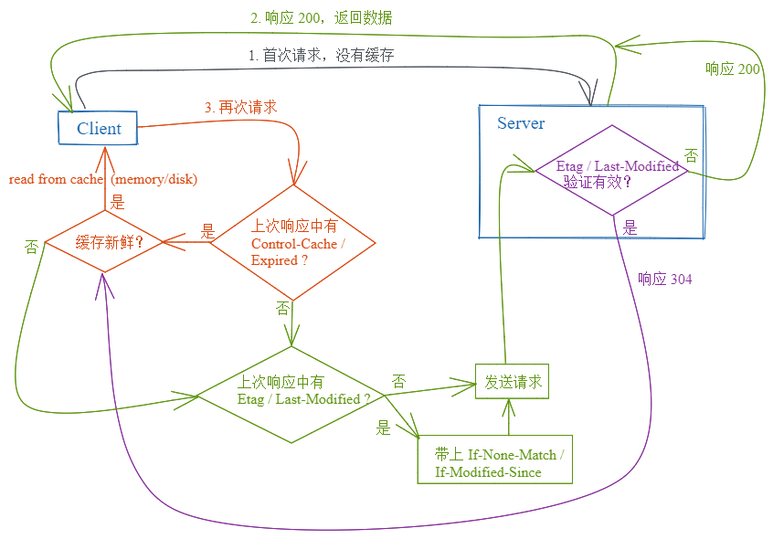

# HTTP 缓存

## 缓存基本概念

缓存本质上就是一种用 `空间换时间` 的策略。

### 使用场景

1. 读操作多于写操作
2. 操作符合 [principle of locality](https://en.wikipedia.org/wiki/Locality_of_reference)

### 命中率

`N(mishit)` 指的是请求的资源不在缓存中，所以需要发送请求到服务器请求该资源。

### 缓存获取和更新策略

[一些缓存策略以及如何选择合适的缓存策略](https://codeahoy.com/2017/08/11/caching-strategies-and-how-to-choose-the-right-one/)

缓存空间是有限的，当缓存空间满了之后，我们需要移除一些缓存数据以便缓存新的数据(cache eviction)，下面是一些缓存更新策略：

- [LRU](https://github.com/suukii/91-days-algorithm/blob/master/basic/day-12.md) (Least recently used)
- LFU (Least frequently used)
- MRU (Most recently used)
- FIFO (First in, first out)

### 单一/分布式缓存

分布式缓存适用于流量比较大的网站。

## CDN 缓存

### 一般流程

- 客户端向 CDN 服务器请求数据；
- CDN 检查当前缓存的数据是否已过期：
  - 如果缓存未过期，CDN 直接把缓存数据返回给客户端；
  - 如果缓存已过期，CDN 会向源服务器请求新的数据，更新缓存，并把新的数据返回给客户端。

关键点在于 CDN 缓存的有效时长应该如何设置：

- 太短的话，CDN 可能需要频繁地向源服务器请求新数据，不仅增加了源服务器的压力，也加长了客户端接收数据的时间；
- 太长的话，有可能发生的情况是，源服务器的数据更新了，但 CDN 仍然在向客户端发送更新前的数据。

## HTTP 缓存

### 使用缓存的好处

- 减轻服务器的压力，服务器不用每次都向客户端发送数据。
- 提高性能，因为缓存离客户端更近，数据传输时间也更短。

### 浏览器会缓存什么

默认情况下 GET 请求会被浏览器主动缓存，以下资源会默认会被缓存：

- GET 请求获取的 HTML 文档、图片、文件
- `301` Moved Permanently 响应的内容
- `404` 响应的内容
- `206` Partial Content 响应的内容

### 如何解决过期数据的问题

由于 HTTP 是一个 client-server 协议，也就是说，如果服务器更新了资源，它没办法主动通知客户端这个资源更新了。

所以，双方需要事先约好一个有效期限，

- 如果客户端在这个有效期限内请求同样的资源，它可以直接从缓存中获取缓存数据；
- 如果客户端在有效期限后发送请求，此时缓存数据已过期，缓存服务器需要向服务器发送请求询问资源是否有被修改：
  - 如果资源没有修改，服务器会响应 `304` (Not Modified)，客户端可以继续使用缓存中的数据；
  - 如果资源被修改了，服务器会返回新的资源。

### 如何设置 HTTP 头部

#### 请求头

一般使用默认设置，交给浏览器处理就好了。

#### 响应头

##### Cache-Control

用于强缓存(不需要发送请求到服务器，直接读取浏览器本地缓存)。

- `no-store`: 完全不缓存任何数据，客户端的每次请求都会发送到服务器(不会被缓存拦截)，服务器也都会返回完整的数据。
- `no-cache`: 会缓存数据，但客户端需要获取数据时，会先发请求到服务器询问当前缓存是否已过期；如果缓存未过期，客户端直接从缓存中获取数据；如果已过期，服务器会返回新的数据。
- `private`: 只有客户端可以缓存，其他公共的缓存服务器不可以。
- `public`: 响应可以被网络中的任何节点缓存。
- `max-age=<seconds>`: 从发起请求的时间开始算，在 `max-age` 设置的时间内该资源都可以被认为是有效的、未过期的。
- `must-revalidate`: 意思是要使用过期数据前需要先跟服务器确认。

##### ETag

用于协商缓存(强缓存失效时或者设置了不走强缓存时需要发送请求到服务器去验证)。

如果客户端发现一份缓存数据过期了，它会发送一个 token(一般是基于数据内容生成的)给服务器，如果跟服务器生成的 token 一样，说明资源没有更新，客户端可以继续使用缓存数据。

客户端并不知道 `ETag` (token) 的值代表什么，这个值由服务器生成并在响应中返回，如果响应中带有这个字段的话，客户端在之后的请求中就可以使用 `If-None-Match` 字段来检查缓存资源是否过期。

##### Last-Modified

用于协商缓存，跟 `ETag` 的作用一样，不过 `ETag` 是根据**内容**来判断资源是否更新，`Last-Modified` 则是根据**时间**来判断。

如果响应中有 `Last-modified` 字段的话，客户端在之后的请求中就可以使用 `If-Modified-Since` 来询问缓存资源是否过期，服务器会返回 `304` 告诉客户端可以继续使用缓存资源，同时也可以更新该缓存资源的过期时间，或者服务器会响应 `200` 并返回新的资源。

##### 一个简单的图解

#### 静态资源

对于不常更新的静态资源，可以使用 versioned URL 或者 URL with [fingerprint](<https://en.wikipedia.org/wiki/Fingerprint_(computing)>)，同时设置 `Cache-Control: max-age=31536000`。

也就是说，在接下来的一年中，客户端再次请求同样的 URL 时都可以从缓存中直接获取；如果服务器上的资源更新了，它会同时更新 URL 中的版本信息或者指纹信息，这样客户端就会从服务器下载新的资源(因为是不一样的 URL 了)。

给文件名加上版本信息或者指纹信息这种操作可以通过打包工具(webpack 等)来实现[自动化](https://webpack.js.org/guides/caching/#output-filenames)。

#### 不同服务器的缓存设置

- [Express](https://expressjs.com/en/api.html#express.static)
- [Apache](https://httpd.apache.org/docs/2.4/caching.html)
- [nginx](http://nginx.org/en/docs/http/ngx_http_headers_module.html)
- [Firebase Hosting](https://firebase.google.com/docs/hosting/full-config)
- [Netlify](https://www.netlify.com/blog/2017/02/23/better-living-through-caching/)

不过，就算服务器没有在响应中设置 `Cache-Control`，浏览器还是会自行判断哪些数据应该要缓存，[Heuristic Freshness](https://www.mnot.net/blog/2017/03/16/browser-caching#heuristic-freshness)。

#### 如何计算缓存有效时长

**freshness lifetime**

- 是否设置 `Cache-Control: max-age=N`：
  - 是，有效时长就是 `N`；
  - 否，是否存在 `Expires` 字段：
    - 是，有效时长就是 `Expires - Date`
    - 否，是否存在 `Last-Modified` 字段：
      - 是，有效时长取 `Date - Last-Modified / 10`

**expiration time**

`expirationRime = responseTime + freshnessLifetime - currentAge`

> responseTime 是浏览器记录的接收到响应的时间

#### tips

- URL 保持一致，如果同样的资源有不同的 URL，这份资源会被多次请求和缓存。
- 如果有一份文件经常更新，但更新的只是其中一小部分，可以把这部分抽离成独立的文件，对两份文件使用不同的缓存策略
- 如果程序可以接受过期的缓存数据的话，`Cache-Control` 还有一个指令 [`stale-while-revalidate`](https://web.dev/stale-while-revalidate/)

## 相关资料

- [x] [HTTP caching – Ilya Grigorik](https://web.dev/http-cache/)
- [x] [Caching: From Top To Bottom](https://coderscat.com/caching-from-top-to-bottom)
- [ ] [HTTP Caching RFC](https://tools.ietf.org/html/rfc7234)
- [ ] [HTTP Caching - MDN](https://developer.mozilla.org/en-US/docs/Web/HTTP/Caching)
- [ ] [Caching Tutorial – Mark Nottingham](https://www.mnot.net/cache_docs/)
- [ ] [Caching Strategies and How to Choose the Right One](https://codeahoy.com/2017/08/11/caching-strategies-and-how-to-choose-the-right-one/)
- [ ] [Service workers and the Cache Storage API – Jeff Posnick](https://web.dev/service-workers-cache-storage/)
- [ ] [Heuristic Freshness](https://www.mnot.net/blog/2017/03/16/browser-caching#heuristic-freshness)
- [RedBot](https://redbot.org/), a tool to check your cache-related HTTP headers.
