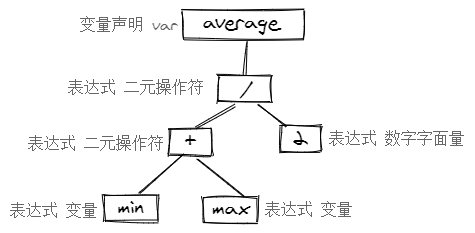

# 编译流程

我们知道程序员和电脑说的是两种完全不同的语言，所以要想让程序运行起来，就得先把我们的代码翻译成电脑可以理解的语言，也就是机器语言，一般这个翻译工作会包括以下几个部分。

## Front End

### 词法分析

词法分析: scanning, lexing, tokenizing, lexical analysis 等。

负责词法分析的工具叫做 scanner 或者 lexer，你只要给它一段代码（代码本质上就是一段字符串），它就会给你返回一系列的 token。这些 token 就相当于英语中的单词，单词是组成英语句子的最小有意义单位，而 token 是组成程序的最小有意义单位。比如你喂给 parser 下面这行代码，

```js
var average = (min + max) / 2 // this is a comment
```

parser 会给你吐出来这样一堆 token 来：


注意到代码中的空格和注释都被忽略掉了，因为空格是没有意义的，而注释，根据定义它们本来就应该被忽略。

一段代码经过 lexer 处理变成一系列 token 后，就可以进入下一道工序**语法分析**了。

### 语法分析

负责语法分析(parsing)的工具叫做 parser，它从 lexer 那里拿到一系列 token 之后，会把它们按照一定的语法组装起来。

你应该在英语试卷上看过这样的题，题目给出一系列单词，要求你把它们拼成意思正确的句子。

parser 的工作跟这个组装句子的过程很像，不过要更简单些，因为英语句子不仅要语法正确还要意思通顺，而 parser 就只需要考虑语法。它会按照指定的语法来把 token 组成表达式或者语句，并用一个树结构表示出来，这棵树就代表了源代码的逻辑。



- 这棵树也有不同名字：parse tree, abstract syntax tree (AST), syntax tree，指的都是同一个东西。
- 每个语言都有自己的语法，一般编程语言都是使用[上下文无关语法](./context_free_grammar.md)来制定自己的语法的。

P.S. 注意到这棵树并没有用到 lexer 给出来的所有 token。Abstract syntax tree 之所以叫 'abstract' 呢，是因为它并没有把代码的所有细节都展示出来(不同于 concrete syntax tree)，它只关心结构和内容相关的部分(可以说是有用的部分吧)。

如果 parser 试过了所有语法规则之后都没办法把现有的 token 组成正确的表达式或者语句的话，它就会抛出一个语法错误。

### 静态分析

上面所说的两个步骤在不同语言中的实现其实都差不多，而在静态分析(static analysis)这一步，不同语言的特性就显示出来了。

经过了词法分析和语法分析之后，我们知道了代码的语法结构，但是要运行程序光知道这些还不够，再来看下这行代码。

```js
var average = (min + max) / 2
```

我们知道要把 `min` 和 `max` 相加，但这两个变量又是从哪里来的呢？它们是局部变量？全局变量？又或者根本没有定义？

在这个阶段，大多数语言会先进行的一个分析步骤叫做 binding ，或者叫 resolution，也就是，

- 每当分析到一个标识符 (identifier) 时，先去找到它的定义，然后将两者关联起来。
- 作用域大概就是这么一回事了，作用域就是代码中的一块空间，并且规定了在这个空间中哪些标识符是可以被访问到的。
- 如果是静态语言，就可以在这个阶段进行类型检查了。找到了标识符的定义，也就知道了变量类型，接着就可以检查这个类型是否支持 `+` 操作，如果不支持，就可以抛出错误了。

经过本分析阶段得到的信息，还得找个地方储存起来，一般它们可能会被存在：

- AST 中，上个阶段我们得到了一个 AST，所以可以把这些信息存到 AST 的各个节点中去；
- 一个额外的表中，用各个标识符来作为表的 key，这个表叫做 symbol table；
- 把 AST 转换成另一种能更直接表示语法的数据结构来存。

**一般把以上三个阶段归为编译过程的 front end，在 front end 中我们的关注点是怎么样把源码用一种抽象的方式表示出来；接下来要讨论的是 back end，在这个阶段我们关注的是怎么根据源码的抽象表示生成机器语言**

## Back End

### 中间语言

不仅程序员和电脑说着不同语言，程序员和程序员之间，电脑和电脑之间，他们说的语言也是不完全相同的。

假设我们有分别用 3 种高级语言写的源码，现在的任务是把它们分别翻译成 3 种不同的机器语言。如果是一对一地翻译的话，那我们会需要 3\*3 种不同的翻译机器。

为了降低成本，我们可以借助一个中间语言(Intermediate Representation, IR)。比如先把 AST 翻译成 IR，然后再把 IR 分别翻译成不同的机器语言，这种情况下我们只需要 3+3 种翻译机器。

### 优化

一旦我们搞懂了程序想要干什么(也就是把代码抽离特定的语法，改用一种抽象的方法来表示，比如 AST)，我们就可以换另一种更高效的方式来把它实现出来，这个过程叫做优化(Optimization)。

一个简单的优化例子是 constant folding，也就是说，如果有一个表达式总是返回相同的结果，编译器就会把在编译代码中用这个计算结果替代这个表达式，比如以下代码：

```js
var area = 3.14 * 0.75 * 2 + 5
```

编译器会对它进行编译优化成下面那样子，这样就不需要在运行时进行计算了。

```js
var area = 9.71
```

### 生成代码

经过优化之后，最后一步就是生成 CPU 可以运行的代码。**生成代码(code generation)**中的*代码*指的是 assembly language(也就是接近机器语言的代码)，而不是我们平时写的代码。在这一步，我们有两个选择：

1. 生成 CPU 可以理解的 native code，OS 可以直接运行这些代码。native code 的运行速度超级快，不过生成过程也比较麻烦。而且，还记得我们说不同电脑说的语言也是不一样的么，如果我们的程序要在不同的 OS 中运行，那我们就得分别生成和这些 OS 一一对应的 native code。

2. 生成 virtual machine code，为了解决上一个方法中的问题，一般 compiler 都选择生成 virtual machine code。不过 CPU 并不能理解 virtual machine code，所以还需要一个 virtual machine 来运行这些代码。现在我们一般把这些代码叫做 bytecode (叫这个名字是因为一个指令的长度一般是一个 byte)，bytecode 和 native code 很接近了，不过 bytecode 不针对某个特定的 OS。

### Virtual Machine

如果在上一步我们选择了生成 bytecode，那我们的翻译工作就还没有结束，因为 CPU 是读不懂 bytecode 的，在这一步我们又要做选择了：

1. 针对每一个 OS 都写一个简单的 compiler 来把 bytecode 编译成 native code。如果是这样的话，bytecode 基本上就充当了一个 IR 的角色。

2. 写一个 Virtual Machine (VM) 来运行 bytecode。不过在 VM 上运行 bytecode 的速度会比预先把 bytecode 编译成 native code 再运行要慢。因为 VM 需要在运行时再去翻译指令，而且同一条指令每次执行都要重新翻译一次。但优点是，我们的代码可以在不同的 OS 中运行。

### Runtime

到这里我们终于拿到了可以运行的代码，最后一步就是运行它们。

1. 如果我们生成的是 native code，那我们只需要通知 OS 加载一下程序，剩下的它自己会搞定。

2. 如果我们生成的是 bytecode，那我们需要先启动 VM 然后在 VM 中加载程序。

无论是哪种情况，在程序运行的时候，我们都需要提供一些服务。比如，如果某个语言是自动管理内存的(比如 JS)，我们就需要一个垃圾收集器去释放内存。如果某个语言支持 `instanceof` 操作，我们就需要在程序运行时记录每个对象的类型。

因为这些操作都是在程序运行时发生的，所以提供这些服务的程序就叫做**运行时(runtime)**。对于一些提前编译的语言来说，runtime 程序的代码一般是直接插入编译好的代码中的，对于使用 interpreter 和 VM 的语言来说，runtime 一般是在 interpreter 或者 VM 中实现。

**至此代码翻译的过程就结束了，以上说的是翻译过程中可能会经历的所有阶段，不过，并不是所有代码翻译的实现都会选择走完所有流程，有些 compiler 在实现翻译的过程中会跳过一些阶段。**

## 常见的编译器

### Single-pass Compilers

有些简单的 compiler 会把 parsing, analysis, code generation 这几个过程合在一起，直接在 parser 中生成代码，所以它们不需要 AST 或者 IR。它们没有像 AST 这样的数据结构来存储程序的信息，也就没法知道前面已经分析过的代码是什么样子的，所以它们必须读到一个表达式就马上能知道怎么样去编译它。

> Syntax-directed translation 就是用于这种 compiler 的一种技术，基本思想就是给每一个语法都关联一个 action，当 parser 分析到相应的语法时就去执行相应的 action 生成目标代码。

### Tree-walk Interpreters

有一些语言会在生成 AST 之后马上执行，所以它们会遍历 AST 的每一个分支并解析每一个节点，不过这种方法往往很慢，一般语言都不会采用这种方式。

### Transpilers

一般的翻译过程是：

`高级语言 --front end--> 抽象描述 --back end--> 机器语言`

但如果我们的目标不是生成机器语言，我们其实也可以这样：

`高级语言 --front end--> 抽象描述 --back end--> 另一种高级语言`

比如 Web Assembly 就是将 C 翻译成 JavaScript 在浏览器中运行的一种技术。

一般这种 compiler 就叫做 transpiler，或者 source-to-source compiler，或者 transcompiler。

### Just-in-time Compiler

运行程序最快的方法当然是将源码提前编译成 native code 啦，不过这样会有 OS 兼容问题，而 Just-in-time Compiler 会在运行程序的时候再把代码编译成对应各个 OS 的 native code。

[Just-In-Time (JIT) Compilers](./just_in_time_compiler.md)

### Compiler & Interpreter

- Compiling: 是指将一段源代码翻译成机器语言或者其他高级语言的过程，这个过程最终会生成 bytecode，或者 machine code，或者另一种高级语言代码。

- Compiler: 将一段源代码翻译成机器语言，但是不运行代码，我们可以自行运行翻译好的代码。

- Interpreter: 直接运行源代码。

[Compiler and Interpreter.md](./compiler_and_interpreter.md)
