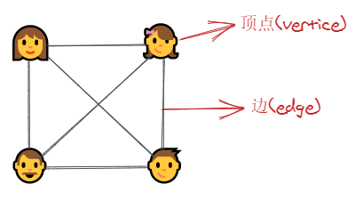
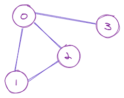
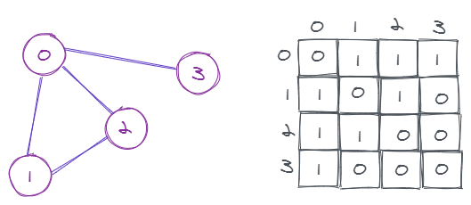
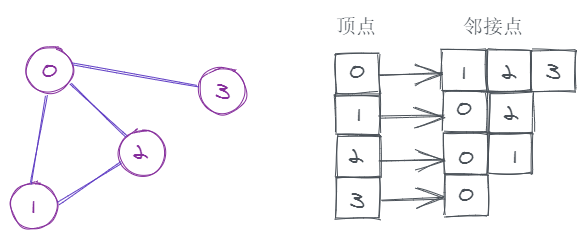

# 数据结构 - 图

## 基本概念

图(graph)是一系列**节点**以及节点间的**关系**组成的集合。

用一个生活中的例子来说明的话，在一个家庭中，有爸爸、妈妈、儿子和女儿，他们每个人都分别是一个节点。而节点之间可能存在着某种关系，比如爸爸和妈妈是夫妻关系，爸爸和儿子是父子关系，我们用一条连接两个节点的**线**来表示它们之间的关系。

在图中，节点叫做**顶点(vertice)**，表示关系的线叫做**边(edge)**。



更准确地说，图 G 可以定义为 `G = (V, E)`，它由两个集合组成：`V(顶点Vertex)` 和 `E(边Edge)`。

- V 是**顶点**的集合。
- E 是**边**的集合，这个集合中元素的格式是 `(u, v)`，其中 `u` 和 `v` 都是顶点，`(u, v)` 则表示顶点 `u` 和 `v` 之间存在关系。



上面这个图可以定义为：

```
V = {0, 1, 2, 3} // 顶点
E = {(0, 1), (0, 2), (0, 3), (1, 2)} // 边
G = {V, E} // 图
```

**一些概念**

- 邻接(Adjacency)：如果两个顶点之间有一条边相连，那这两个顶点就是相互邻接的。
- 路径(Path)：指的是从`顶点A`到`顶点B`要经过的一系列**边**的集合。
- 有向图(Directed Graph)：在有向图中，有边 `(u, v)` 不代表有边 `(v, u)`，在有向图中**边**一般都用箭头来表示方向，而上面所说的是无向图。

## 图的表示

### 邻接矩阵(Adjacency Matrix)

邻接矩阵是一个二维数组，每一行和每一列都分别表示一个顶点。如果 `matrix[i][j]` 是 `1` 的话，说明`顶点i`和`顶点j`有一条边相连。

用邻接矩阵来表示上面那个图的话：



由于这是一个无向图，所以 `(0, 2)` 表示 `(2, 0)` 也是存在的，也就是 `matrix[0][2]` 和 `matrix[2][0]` 都是 `1`。

使用邻接矩阵的优点是，**查找边**(也就是查询两个顶点之间是否有边相连)的操作会很快，只需要 O(1) 的时间复杂度，但这种方法占用的内存空间也比较多。从上图可以看出，即使两个顶点之间没有边相连，但在矩阵中还是占用了一个位置来记录它们“没有关系”的关系，空间复杂度为 O(N^2)，N 是顶点的数量，所以也可以表示为 O(V^2)。

### 邻接表(Adjacency List)

邻接表可以用一个哈希表来表示，哈希表的 `key` 表示图的顶点，`value` 则是一个列表，存放着该顶点的邻接点，这个列表可以是数组或链表等。

上面的图用邻接表来表示的话：



邻接表相对邻接矩阵来说更节省空间，因为只需要存储实际存在的关系，空间复杂度可以表示为 O(|V| + E)，V 是顶点数量，E 是边的数量；但查找边的时间复杂度就提高到了 O(N)，N 为顶点数量，也可表示为 O(V)。

## 图的遍历

下面用邻接表来实现一个简单的无向图。

```js
class Graph {
  constructor(noOfVertices) {
    this.noOfVertices = noOfVertices // 顶点数量
    this.adjList = new Map() // 邻接表
  }

  // 增加顶点
  addVertex(v) {
    // 在邻接表中增加一个列表来记录该顶点的邻接点
    this.adjList.set(v, [])
  }

  // 增加边
  addEdge(v, w) {
    // 分别把顶点 v, w 加到对方的邻接点列表中
    this.adjList.get(v).push(w)
    this.adjList.get(w).push(v)
  }

  bfs(v) {}

  dfs(v) {}
}
```

### BFS

关键点：把顶点分为“已遍历”和“未遍历”两个类别，避免无限循环。

**伪代码**

```
选一个顶点作为遍历的起点
把顶点放进一个队列Q中

当队列Q不为空时，重复以下步骤：
    出列一个顶点，把它加到“已遍历”列表中
    遍历这个顶点的邻接点列表：
        如果邻接点属于“未遍历”，把它加到队列Q中
```

注意：如果图中存在一个顶点，从选定的起点并不能到达这个顶点，那它就不会被遍历到。可以对上述代码进行改造，对图中的每一个顶点，都将它们作为起点进行一次遍历。

**复杂度分析**

- 时间复杂度：O(V + E)，V 是顶点数量，E 是边的数量。
- 空间复杂度：O(V)，V 是顶点数量。

**代码**

```js
bfs(v) {
  const visited = Array(this.noOfVertices).fill(false)
  const queue = []
  queue.push(v)
  visited[v] = true
  while (queue.length > 0) {
    const node = queue.shift()
    console.log(node)
    const neighs = this.adjList.get(node)
    neighs.forEach((neigh) => {
      if (!visited[neigh]) {
        visited[neigh] = true
        queue.push(neigh)
      }
    })
  }
}
```

### DFS

**伪代码**

```
选一个顶点作为遍历的起点
把顶点放进一个栈中

当栈不为空时，重复以下步骤：
    出栈一个顶点，把它加到“已遍历”列表中
    遍历这个顶点的邻接点列表：
        如果邻接点属于“未遍历”，将它入栈
```

**复杂度分析**

- 时间复杂度：O(V + E)，V 是顶点数量，E 是边的数量。
- 空间复杂度：O(V)，V 是顶点数量。

**代码**

```js
dfs() {
  const stack = []
  stack.push(v)

  while (stack.length > 0) {
    const vertex = stack.pop()
    if (!visited[vertex]) {
      visited[vertex] = true
      console.log(vertex)
    }
    const neighs = this.adjList.get(vertex)
    neighs.reduceRight((_, neigh) => {
      if (!visited[neigh]) {
        stack.push(neigh)
      }
    }, null)
  }
}
```

也可以用递归来实现，下面的代码同时也考虑了上面提到的“图中存在两个不直接或间接相连的顶点”这个问题。

```js
dfs() {
  const visited = Array(this.noOfVertices).fill(false)
  const vertices = this.adjList.keys()
  for (let vertex of vertices) {
    if (!visited[vertex]) {
      this.dfsUntil(vertex, visited)
    }
}
}
dfsUntil(v, visited) {
  if (!visited[v]) {
    visited[v] = true
    console.log(v)
  }
  const neighs = this.adjList.get(v)
  neighs.forEach((neigh) => {
    if (!visited[neigh]) {
      this.dfsUntil(neigh, visited)
    }
  })
}
```

```js
var g = new Graph(6)
var vertices = ['A', 'B', 'C', 'D', 'E', 'F']
for (var i = 0; i < vertices.length; i++) {
  g.addVertex(vertices[i])
}
g.addEdge('A', 'B')
g.addEdge('A', 'D')
g.addEdge('A', 'E')
g.addEdge('B', 'C')
g.addEdge('D', 'E')
g.addEdge('E', 'F')
g.addEdge('E', 'C')
g.addEdge('C', 'F')
g.dfs('A')
g.bfs('A')
```
