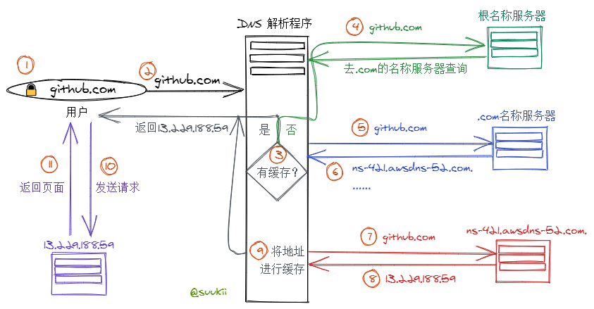

## 授权型 DNS 服务器

授权型 DNS 服务器(authoritative DNS server, aka, nameserver 名称服务器)，会把它们所管理的域名下的所有 IP 地址存放在数据库中，我们向授权型 DNS 服务器查询某个域名的 IP 地址时，可以直接获取返回结果。

比如 `github.com` 的一个授权型 DNS 服务器是 `ns-421.awsdns-52.com.`，我们可以通过

```
dig @ns-421.awsdns-52.com github.com +short
```

直接查到 `github.com` 的 IP 地址，`+short` 是一个参数，表示只显示结果，隐藏其他查询细节。

不过通常客户端不会对授权型 DNS 服务器直接进行查询，而是通过递归型 DNS 服务器。

## 递归型 DNS 服务器

递归型 DNS 服务器(recursive DNS server)并不知道哪个域名对应哪个 IP 地址，它们是通过向授权型 DNS 服务器询问，最终找到正确的 IP 地址，然后把 IP 地址进行缓存以便再次查询。

```
dig github.com +trace
```

使用 `+trace` 参数会显示递归查询的过程。

## 如何通过递归型 DNS 服务器查询 IP 地址？



1. 用户在浏览器中输入 `github.com`；
2. `github.com` 请求被路由到 DNS 解析程序(一般由 ISP 进行管理)；
3. 如果 ISP 的 DNS 解析程序上有 `github.com` IP 地址的缓存，直接返回缓存，如果没有缓存或者缓存已过期，那就继续查询；
4. DNS 解析程序将请求转发到 DNS 根名称服务器(root nameserver)；
5. 根名称服务器根据请求的信息，决定把请求转发到 `.com` 域的一个 TLD(top-level domain)名称服务器；
6. 对于这个请求，`.com` 域的名称服务器响应了 8 个与 `github.com` 相关的名称服务器；
7. ISP 的 DNS 解析程序选择其中一个名称服务器 `ns-421.awsdns-52.com.` 并向它转发 `github.com` 请求；
8. 这个名称服务器在托管 `github.com` 的区域找到相应的 IP 地址 `13.229.188.59` 返回；
9. ISP 的 DNS 解析程序最终获取用户需要的 IP 地址，将它缓存起来，并把地址返回给浏览器；
10. 浏览器将请求发送到 `13.229.188.59`；
11. `13.229.188.59` 上的 Web 服务器将页面返回显示在浏览器中。