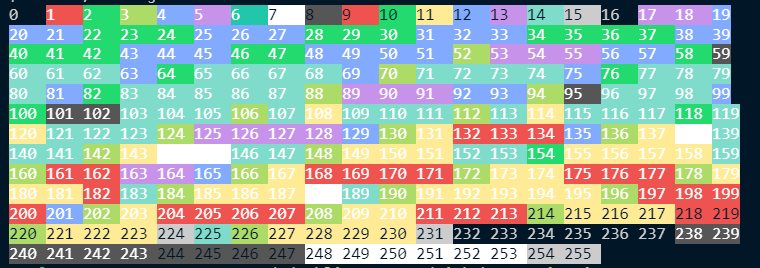
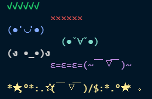

# 如何在终端打印出有<b style="background: -webkit-linear-gradient(45deg, #99d4ff, #9384f6);-webkit-background-clip: text;-webkit-text-fill-color: transparent;">颜色</b>的字

## 8-bit color

syntax:

```
ESC[ 38;5;⟨n⟩ m Select foreground color
ESC[ 48;5;⟨n⟩ m Select background color
```

-   `ESC` 指**non-printable control character `escape`**，具体的值是 `\x1b`。

e.g.(Nodejs)

```js
const bg = 255;
const text = 'hello world';

// setting background
console.log(`\x1b[48;5;${i}m${text}`);

// reset setting
console.log(`\x1b[0m`);

// setting background and foreground
console.log(`\x1b[48;5;255m\x1b[38;5;222m${text}`);
```

打印所有 8-bit 颜色：



```js
const print256Color = () => {
    for (let i = 0; i < 256; i++) {
        const text = String(i).padEnd(4);
        const background = `\x1b[48;5;${i}m`;
        let foreground = '\x1b[30m'; // black

        if (
            (i >= 0 && i <= 6) ||
            (i >= 16 && i <= 213) ||
            (i >= 232 && i <= 243)
        )
            foreground = '\x1b[37m'; // white

        const clear = `\x1b[0m`;
        process.stdout.write(`${background}${foreground}${text}${clear}`);
    }
};
```

## 24-bit color

```
ESC[ 38;2;⟨r⟩;⟨g⟩;⟨b⟩ m Select RGB foreground color
ESC[ 48;2;⟨r⟩;⟨g⟩;⟨b⟩ m Select RGB background color
```

e.g.

```js
const text = 'suukii';

// foreground
const fgRed = '255';
const fgGreen = '255';
const fgBlack = '0';

console.log(`\x1b[38;2;${fgRed};${fgGreen};${fgBlack}m${text}`);

// reset
console.log(`\x1b[0m`);

// background
const bgRed = '255';
const bgGreen = '255';
const bgBlack = '0';

console.log(`\x1b[48;2;${bgRed};${bgGreen};${bgBlack}m${text}`);
```

## Some color references

```
Reset = "\x1b[0m"
Bright = "\x1b[1m"
Dim = "\x1b[2m"
Underscore = "\x1b[4m"
Blink = "\x1b[5m"
Reverse = "\x1b[7m"
Hidden = "\x1b[8m"

FgBlack = "\x1b[30m"
FgRed = "\x1b[31m"
FgGreen = "\x1b[32m"
FgYellow = "\x1b[33m"
FgBlue = "\x1b[34m"
FgMagenta = "\x1b[35m"
FgCyan = "\x1b[36m"
FgWhite = "\x1b[37m"

BgBlack = "\x1b[40m"
BgRed = "\x1b[41m"
BgGreen = "\x1b[42m"
BgYellow = "\x1b[43m"
BgBlue = "\x1b[44m"
BgMagenta = "\x1b[45m"
BgCyan = "\x1b[46m"
BgWhite = "\x1b[47m"
```

## A simple chalk tool

```js
const chalk = (function () {
    const colorMappings = {
        30: 'black',
        31: 'red',
        32: 'green',
        33: 'yellow',
        34: 'blue',
        35: 'magenta',
        36: 'cyan',
        37: 'white',
    };

    const chalk = Object.entries(colorMappings).reduce((chalk, [key, name]) => {
        chalk[name] = text => console.log(`\x1b[${key}m${text}\x1b[1m`);
        return chalk;
    }, {});

    return chalk;
})();

chalk.green(`√√√√√√`);
chalk.red(`        ××××××`);
chalk.blue(`(●'◡'●)`);
chalk.cyan(`          (●ˇ∀ˇ●)`);
chalk.white(`(ง •_•)ง`);
chalk.magenta(`        ε=ε=ε=(~￣▽￣)~`);
chalk.yellow(`\n*★,°*:.☆(￣▽￣)/$:*.°★* 。`);
```



## more info

-   [ANSI escape code](https://en.wikipedia.org/wiki/ANSI_escape_code)
