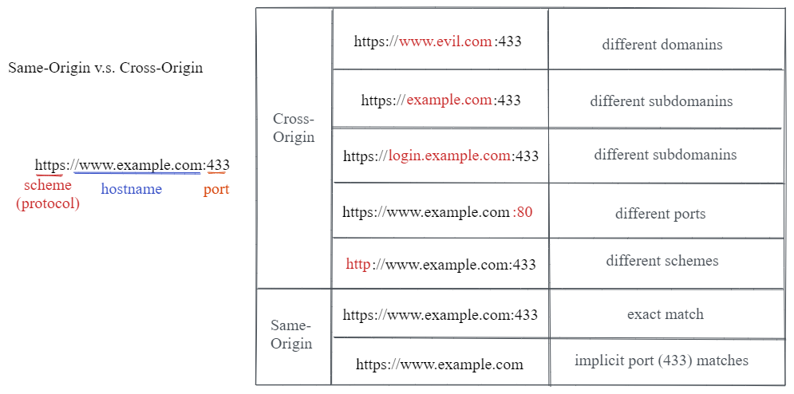
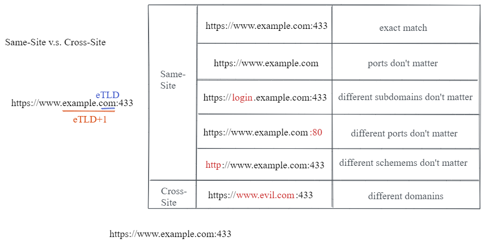

# 如何分辨同源和同

## Origin

`scheme` + `hostname` + `port` 都一样的两个 URL 才会被认为是同源(Same-Origin)，否则就是 Cross-Origin。

## Site

`Top-level domain (TLD)` + `TLD 前面的那部分 domain` 相同的两个 URL 就是同站(Same-Site)，否则就是 Cross-Site。

不过，对于 `.co.jp` 和 `.github.io` 这种 domain，如果只是把 `.jp` 和 `.io` 当作 TLD，这样是不够判断两个 URL 是否 Same-Site 的。所以就有了 effective TLD 这个概念，简写成 `eTLD`，比如以 `.co.jp` 结尾的 URL，它们的 `eTLD` 就是 `.co.jp`。

`eTLD` 和它前面的那部分 domain 加起来被称为 `eTLD+1`，只要两个 URL 的这个部分一致，它们就是 Same-Site。

可以看到 Same-Site 的判断是不会考虑 scheme 的，不过有时候我们可能想要加上这个判断条件，把 scheme 考虑在内的 Same-Site 判断就叫 schemeful same-site，除了增加判断两个 URL 的 scheme 是否一致这个条件，其他判断两者是一样的。

## Sec-Fetch-Site

用来判断请求是否 Same-Site 或者 Same-Origin，目前只有 Chrome 支持这个头部字段，其值为以下之一：

- cross-site
- same-site
- same-origin
- none
