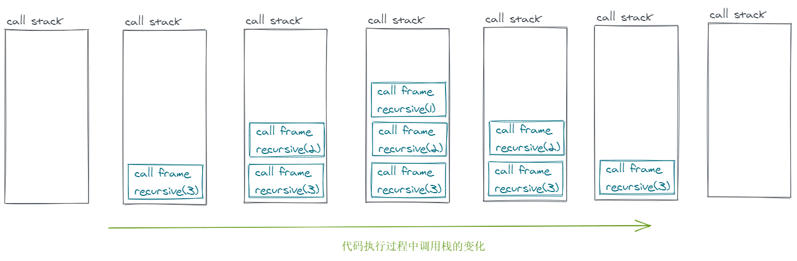
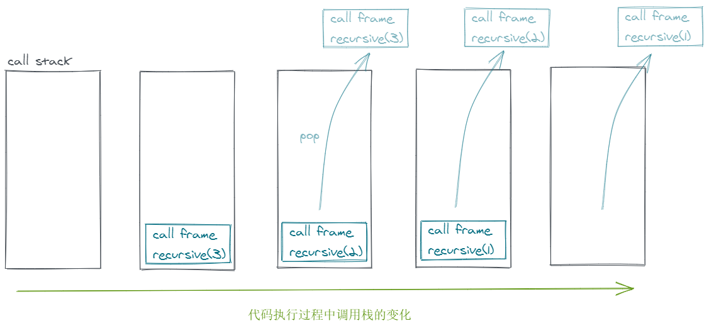

# 尾调用优化

虽然尾调用优化(Tail Call Optimization)是 ES6 规范中的一部分，但其实[大部分 JS 引擎都没有实现](<https://kangax.github.io/compat-table/es6/#test-proper_tail_calls_(tail_call_optimisation)>)。

## 什么是尾调用优化？

正常情况下代码执行时，如果执行到一个函数，就会创建一个执行上下文推入到执行栈中，等到函数执行结束后再将这个执行上下文出栈。

如果我们在一个函数中调用了另一个函数，执行上下文就会在执行栈中一个一个摞起来。

下面是一个简单的递归：

```js
const recursive = (n) => {
  if (n < 0) return
  console.log(n)
  recursive(n - 1)
}
recursive(10000)
```

在执行这段代码的时候，JS 引擎会不断地创建新的 `recursive` 执行上下文并推入执行栈中，如果 `n` 足够大，执行栈的内存空间最终会被用完并抛出栈溢出错误。



如果我们仔细观察下上面的代码，会发现在调用了 `recursive(n - 1)` 之后，`recursive(n)` 的执行上下文其实已经没用了。因为在 `recursive(n - 1)` 这个操作之后，已经没有别的代码需要用到 `recursive(n)` 上下文中的任何变量了。那么，`recursive(n)` 的执行上下文其实没必要等到 `recursive(n - 1)` 执行完毕之后再出栈，而是在调用 `recursive(n - 1)` 的时候就可以出栈了，这就是尾调用优化。



## 尾调用优化的实现

V8 曾经实现过尾调用优化，但后来又放弃了，主要是因为实现尾调用优化意味着要在代码执行的过程中修改调用栈，这样的话，执行流的信息就不完整了，而且还会导致两个问题：

1. debug 的时候调用栈信息不完整
2. [error.stack](https://developer.mozilla.org/en-US/docs/Web/JavaScript/Reference/Global_Objects/Error/Stack) 的信息会不完整

鉴于这些原因，V8 团队建议修改规范，把 [PTC(Proper Tail Calls)](http://www.ecma-international.org/ecma-262/6.0/#sec-tail-position-calls) 改为 [STC(Syntatic Tail Calls)](https://github.com/tc39/proposal-ptc-syntax)，也就是要用特定的语法来使用尾调用，比如 `return continue func()`。目前 V8 还是不支持的，曾经它提供了 `--harmony-tailcalls` 和 `--harmony-explicit-tailcalls` 来开启尾调用优化，不过后来又移除了。

## 如何分辨尾调用

https://2ality.com/2015/06/tail-call-optimization.html#checking-whether-a-function-call-is-in-a-tail-position

## 相关资料

- https://v8.dev/blog/modern-javascript#proper-tail-calls
- https://2ality.com/2015/06/tail-call-optimization.html
- https://github.com/tc39/proposal-ptc-syntax
