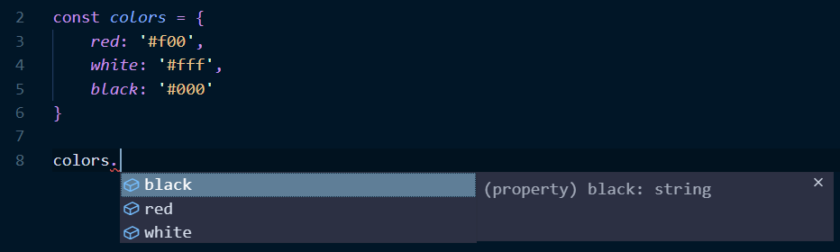
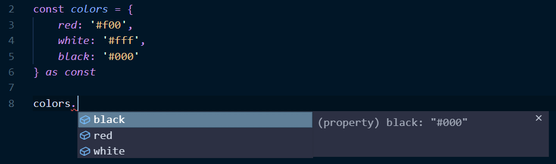

# TypeScript 学习笔记 - `as const`

假设我们定义了一个 `colors` 变量

```ts
const colors: { [prop: string]: string } = {
    red: '#f00',
    white: '#fff',
    black: '#000',
};
```

之后我们想要在程序的其他地方使用这个变量时，可能会得到这样的提示



提示告诉我们，`black` 的类型是 `string`，但如果我们想要知道 `black` 的值是什么，就得回到 `colors` 的定义处查询。

如果我们加上 `as const`，再来看看提示

```ts
const colors: { [prop: string]: string } = {
    red: '#f00',
    white: '#fff',
    black: '#000',
} as const;
```



这次提示不仅告诉了我们 `black` 属性是 `string` 类型的，还把它的值 `#000` 也提示出来了。

`as const` 还有一个用途，就是把对象的属性都变成 `readonly`，而且这个作用对于**嵌套属性**也是生效的。


